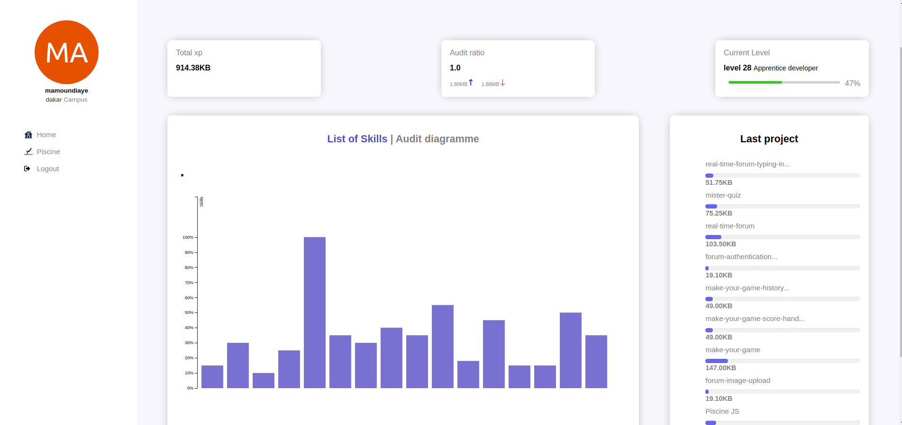

# GraphQL Profile 

This project is a web application that allows  users to create their own profile page by querying a GraphQL endpoint. The profile page displays user information and includes a statistics section with SVG graphs. The UI is implemented using vanilla JavaScript and Web Components.

## Features

- **Login Page:** Allows users to log in using either their username or email along with a password. Invalid credentials display appropriate error messages. Provides a logout functionality.

- **Profile Page:** Displays user information obtained from the GraphQL endpoint. The profile includes:
  - Basic user identification
  - XP amount
  - Grades
  - Audits
  

- **Statistic Section:** Includes at least two different SVG graphs representing different aspects of the user's journey and achievements in school:
  -  Skills
  - Audit 

## Setup

1. Clone the repository:

   ```bash
   git clone https://learn.zone01dakar.sn/git/mamoundiaye/graphql.git #for zone01 student 

    git clone https://github.com/alpapie/Z01-Profil.git
    #for github
   ```
## hosting link
[Zone 01 profile](https://zone01profile.vercel.app/)

## Authors
**[mamoundiaye](https://github.com/alpapie?tab=repositories)**<br>